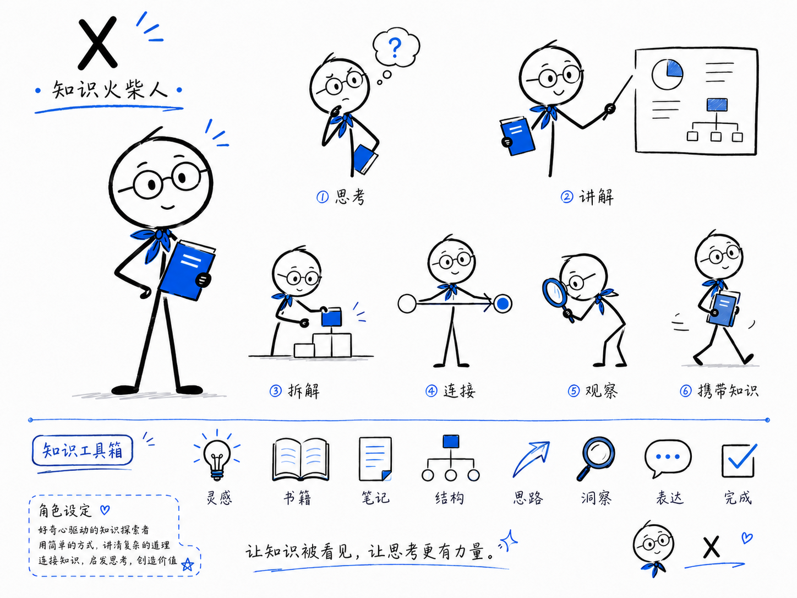
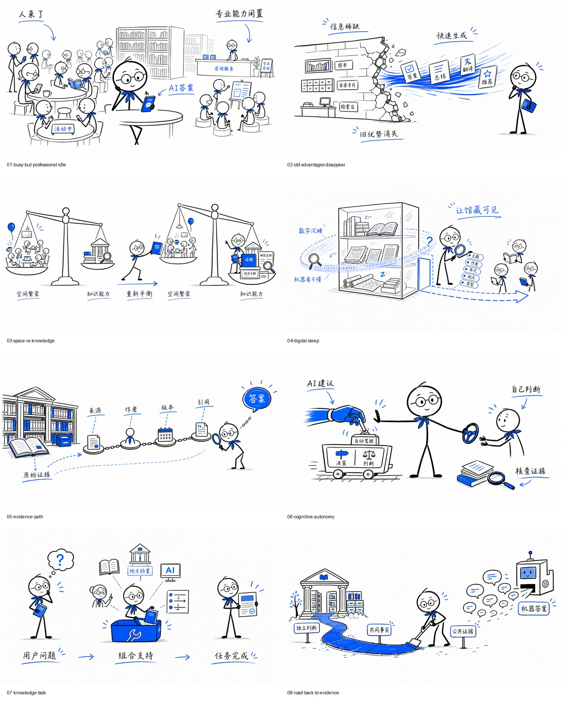

# X-IP-illustration

一个面向中文长文、公众号、帖子和课程内容的 Codex Skill。

它会先拆解文案中的核心判断、认知转折、流程与隐喻，再使用固定 IP **X**，逐页生成白底、黑色手绘线条、钴蓝强调色的正文插画。



## 能做什么

- 拆解长文并生成逐页 `shot list`
- 将抽象观点转成可视化隐喻
- 使用固定角色 X 连续生成多张插画
- 将书面文章改写为 60 秒、90 秒、3 分钟或 5 分钟口播
- 生成画面、口播、屏幕短字、时长和转场逐页对应的视频脚本
- 提供已固化的“短视频口播”风格：前 10 秒建立矛盾、短句强递进、默认 90 秒、不使用虚假悬念
- 保持角色、线条、配色和留白一致
- 对角色漂移、错字和画面拥挤进行检查与修正

默认不是把文章排成 PPT，而是让每张图只解释一个核心观点。

## X 的视觉特征

- 圆形白色头部
- 圆框眼镜
- 头顶一小撮短发
- 黑色火柴人身体
- 钴蓝色领巾
- 温和、专注、略带思考感

## 安装

将仓库克隆到 Codex Skills 目录：

```bash
git clone https://github.com/x19990416/X-IP-illustration.git \
  ~/.codex/skills/x-knowledge-illustrations
```

也可以下载仓库后，将整个目录复制到：

```text
~/.codex/skills/x-knowledge-illustrations
```

## 使用

```text
使用 $x-knowledge-illustrations，拆解下面这篇文案，先生成逐页插画脚本，再逐页生成图片。
```

也可以指定数量：

```text
使用 $x-knowledge-illustrations，把下面的文章拆成 8 页连续插画。保持 X 的角色、蓝黑手绘风格和画面比例一致，每页只讲一个核心观点。
```

生成纯口播稿：

```text
使用 $x-knowledge-illustrations，把这篇文章改写成 90 秒口播文案。保留核心判断，语言自然，可以直接朗读。
```

调用已固化的短视频风格：

```text
使用 $x-knowledge-illustrations，采用“短视频口播”风格，把这篇文章改写成 90 秒口播。面向普通用户，不编造案例，不添加关注引导。
```

生成图文口播联动稿：

```text
使用 $x-knowledge-illustrations，把这篇文章拆成 8 页、约 3 分钟的视频脚本。每页输出 X 插画设计、口播、屏幕短字、建议时长和转场。
```

## 项目结构

```text
X-IP-illustration/
├── SKILL.md
├── agents/
│   └── openai.yaml
├── assets/
│   └── x-ip-reference.png
├── references/
│   ├── composition.md
│   ├── prompt-guide.md
│   ├── qa.md
│   ├── style-system.md
│   ├── voiceover.md
│   ├── styles/
│   │   └── short-video.md
│   └── x-ip.md
└── examples/
    └── public-library-ai/
```

## 生成案例

下面的案例来自文章[《人工智能时代公共图书馆的价值重构》](https://mp.weixin.qq.com/s/1Qp_SG_xzBI4SFJi5FK-7A)：



案例拆解为八个认知页面：

1. 人来了，专业能力却被闲置
2. AI 正在瓦解信息稀缺时代的旧优势
3. 空间繁荣与知识能力重新平衡
4. 无法发现和调用的馆藏陷入数字沉睡
5. 从答案返回原始证据
6. 保护公众的认知自主权
7. 从交付资源转向支持知识任务
8. 为机器答案铺设返回公共证据的道路

对应的 3 分钟图文口播测试见：[voiceover-script.md](examples/public-library-ai/voiceover-script.md)。

短视频口播风格的 90 秒测试见：[short-video-90s.md](examples/public-library-ai/short-video-90s.md)。

## 说明

X 是知识表达中的参与者，而不是角落里的装饰。每张图都应让 X 承担思考、讲解、拆解、连接、观察或携带知识的核心动作。
